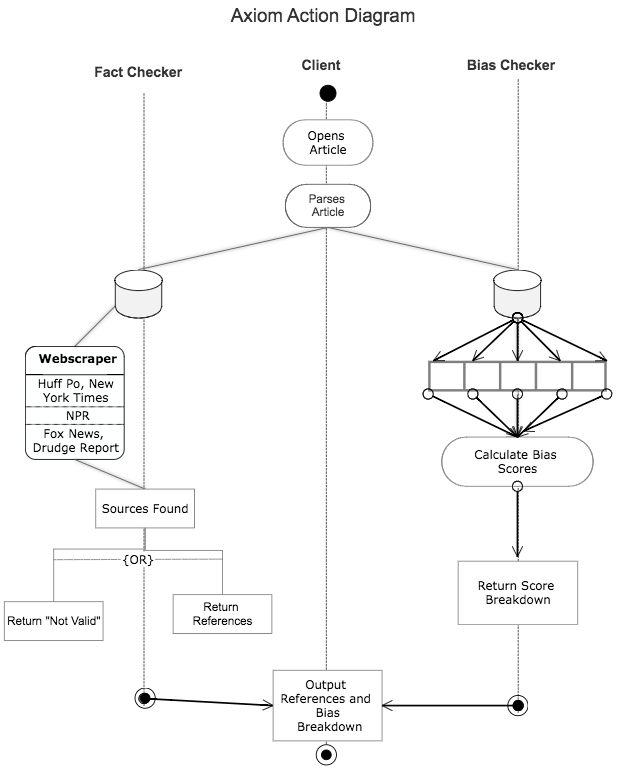

## Problem Statement

How might we identify, reduce, and measure the circulation of misinformation and bias in digital media? 

## Who Are We?
5 Grand Challenges students who aim to create a neural network that tracks bias in digital media and establish a database that autonomously identifies whether information published in digital media is in fact valid. 

```markdown
Syntax highlighted code block

# Header 1
## Header 2
### Header 3

- Bulleted
- List

1. Numbered
2. List

**Bold** and _Italic_ and `Code` text

[Link](url) and 

```

For more details see [GitHub Flavored Markdown](https://guides.github.com/features/mastering-markdown/).
